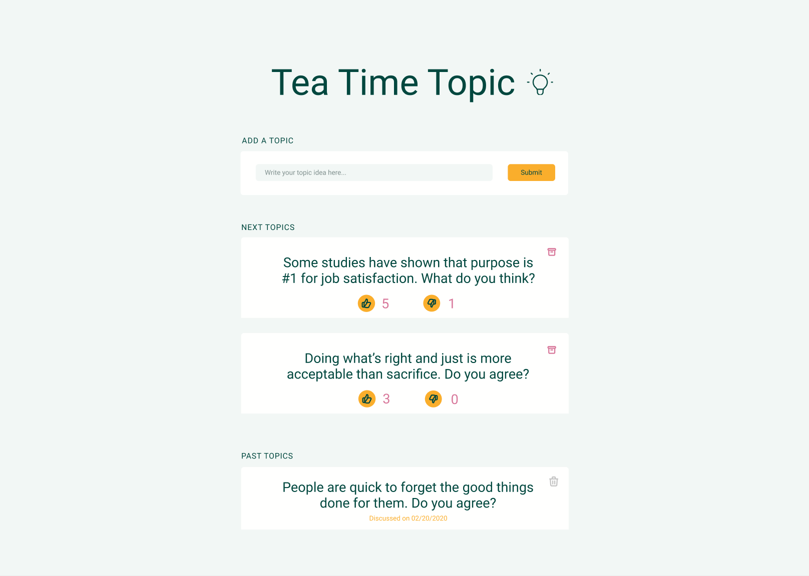

# Tea Time Topic

Let's recreate our last JS challenge, as a React app.

Your task today is to build a new tool that will help us decide which topic we'll discuss during the next tea break.

The web app displays the list of topics, and we'll be able to vote for the ones we like. You'll also be able to downvote a topic that you don't really find interesting. And of course, you'll be able to propose a new topic that you have in mind, via a form.

Once a subject is discussed, you'll be able to archive the subject.

### Screenshot

Figma link : [https://www.figma.com/file/c0VGLdStNQYkXRKx1PKBAD/Tea-Time-Topic?node-id=0%3A1](https://www.figma.com/file/c0VGLdStNQYkXRKx1PKBAD/Tea-Time-Topic?node-id=0%3A1)

API link : https://gist.githubusercontent.com/Pinois/93afbc4a061352a0c70331ca4a16bb99/raw/6da767327041de13693181c2cb09459b0a3657a1/topics.json

### User stories

-   Users should be able to see the list of subject hosted on [this API url.](https://gist.githubusercontent.com/Pinois/93afbc4a061352a0c70331ca4a16bb99/raw/6da767327041de13693181c2cb09459b0a3657a1/topics.json)
-   The topics with an empty attribute "discussedOn" will appear on the "Next topics", while the ones with a date present on the attribute will be listed on the Past Topics list.
-   Users should be able to add a new topic to the list.
-   Users should be able to upvote, or downvote an element.
-   The list of next topics are sorted depending on their Like / Dislike ratio, ascending. For example, a topic with 6 upvotes and 3 downvotes (ratio 6-3 = **3**) will appear before one with 4 upvotes and 3 downvotes (ratio 4-3, **1**)
-   Once a topic has been discussed, Users should be able to archive a subject, by clicking the archive button (pink button on the screenshot). The archive topic will be now shown on the list of past topics, which is sorted from from the latest topic discussed to the earliest. The action of "archiving" a topic will add a date automatically to the topic.
-   Once a topic is archived, you should be able to delete it completely from the app, by clicking the grey trash icon. This icon only appears on the list of past topics.

### Things to remember

-   Is there a clear documentation explaining your project?

-   Do I see the list from the API appearing on the page?

-   Can I add a new element?

-   Is the list sorted as the statement asked?

-   Can I upvote a topic?

-   Can I downvote topic?

-   Does the list update the sorting in the right way after a vote?

-   Can I archive an element? (the box icon)

-   Does an archived element go into the Past Topic list?

-   Can I delete an element from the Past Topic list? (the trash icon)

-   If I refresh the page, is the state of the app saved or lost?

-   Is the code structured in modules?

-   Is the design responsive?

Fork this repo and clone your fork!

Good luck!
